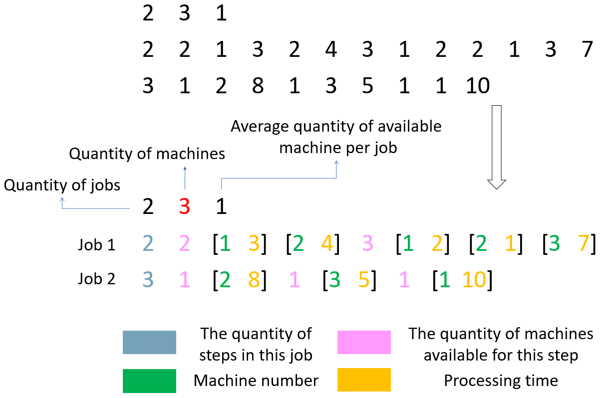
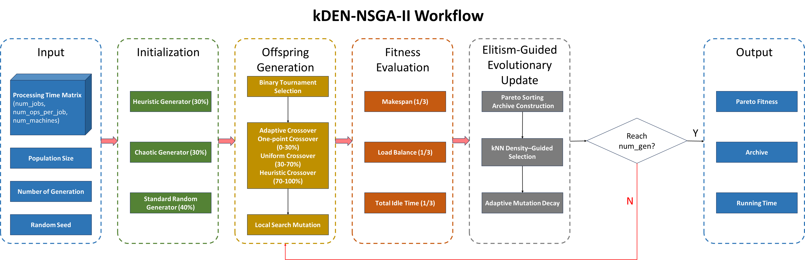
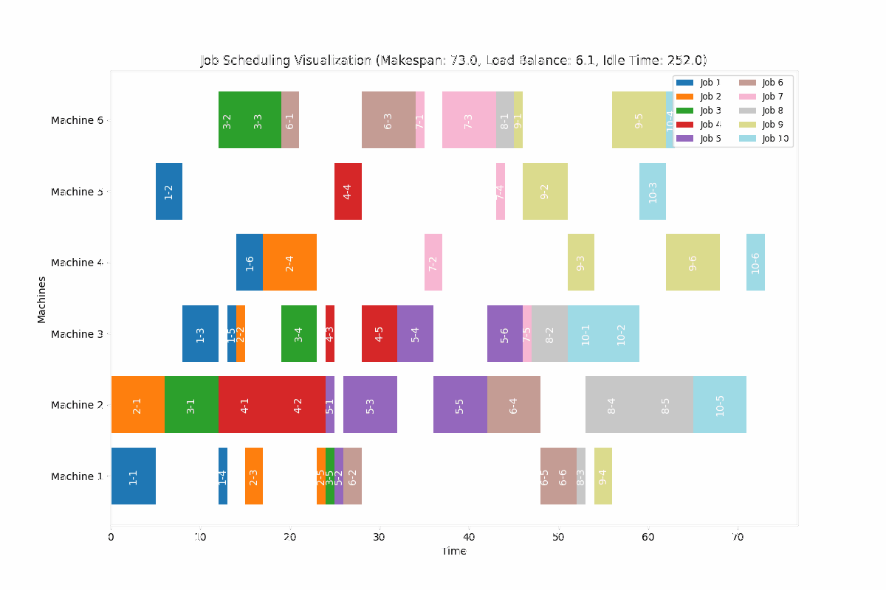
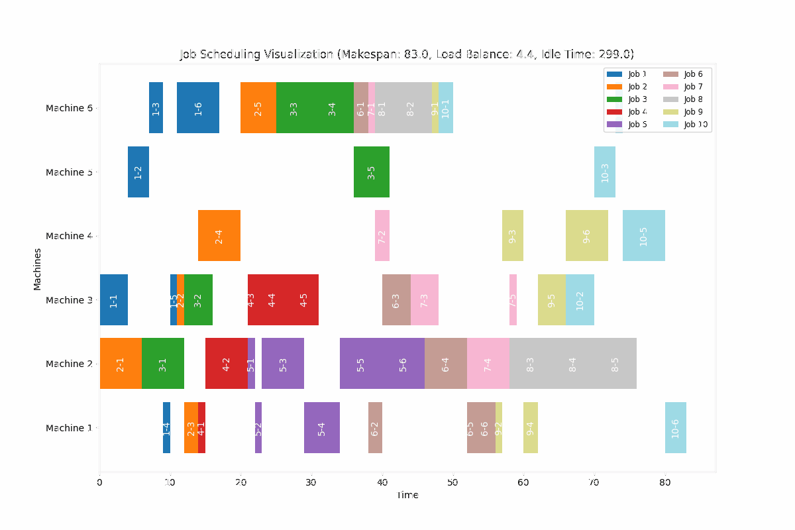
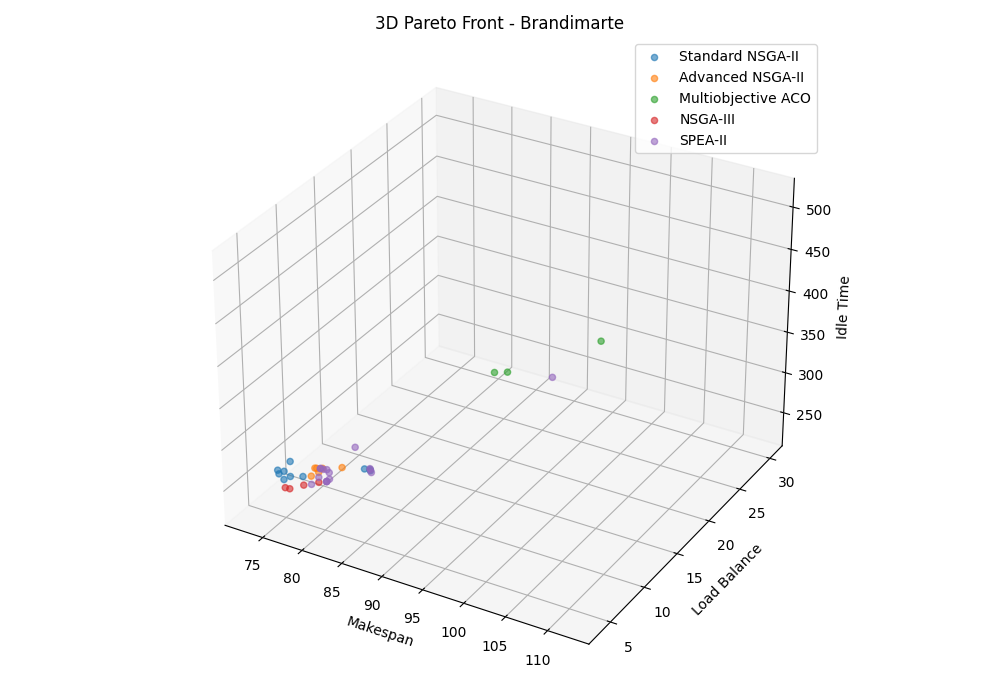
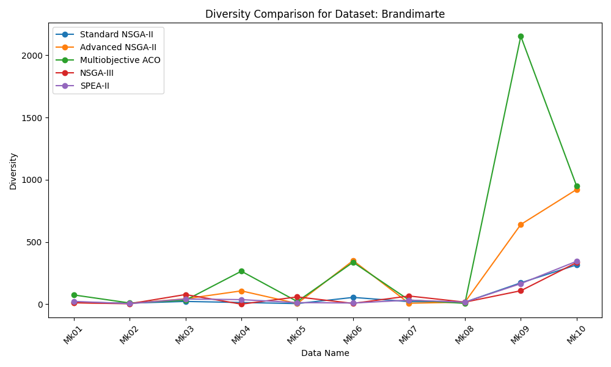
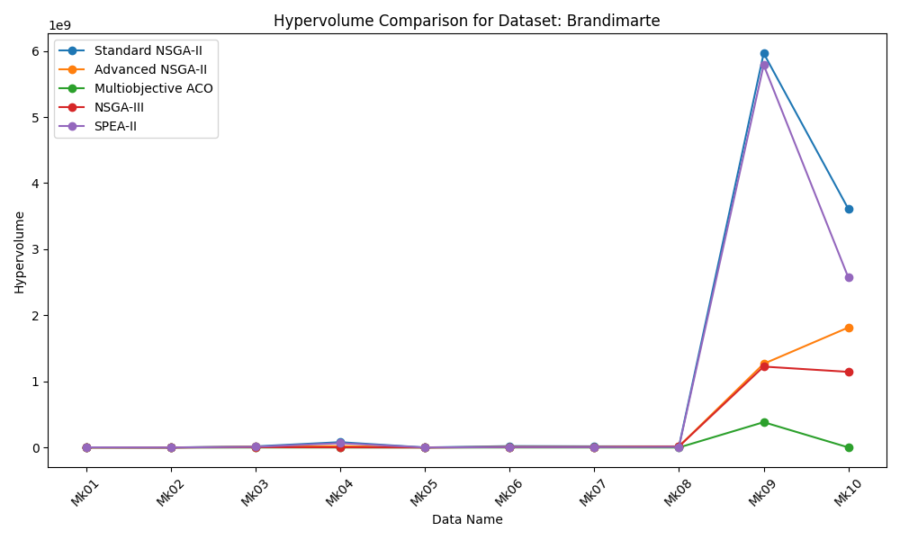
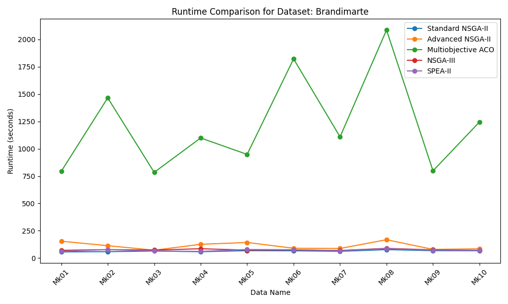

# BioAI_Project

## kDEN-NSGA-II: kNN-Density Enhanced NSGA-II with Adaptive Operators for Flexible Job-Shop Scheduling

[](https://deepwiki.com/Avalon-S/BioAI_Project)

---

## Statement

The old version of the project has been moved to the [`legacy_branch`](https://github.com/Avalon-S/BioAI_Project/tree/legacy_branch).  

📌 **Note:** The `legacy_branch` is *not included by default in forks*.

To fetch it manually, run:

```bash
git remote add upstream https://github.com/Avalon-S/BioAI_Project.git
git fetch upstream legacy_branch
git checkout -b legacy_branch upstream/legacy_branch
```

or directly download the `.zip` file from this [link](https://github.com/Avalon-S/BioAI_Project/archive/refs/heads/legacy_branch.zip).

---

## Table of Contents

1. [Introduction](#introduction)
2. [Overview of Algorithms](#overview-of-algorithms)
3. [Experiment Platform](#experiment-platform)
4. [Visualization](#visualization)
5. [Usage](#usage)
6. [Project Structure](#project-structure)
7. [License](#license)
8. [Citation](#citation)

---

## Introduction

This project focuses on solving the **Flexible Job Shop Scheduling Problem (FJSP)** using a heuristic **NSGA-II** algorithm. FJSP is a well-known NP-hard problem that requires assigning operations to machines in a way that optimizes multiple conflicting objectives, such as **minimizing makespan**, **balancing load** and **total idle time** across machines.

The proposed method enhances the classic NSGA-II framework by integrating `hybrid initialization`, `adaptive crossover`, `local search`, and `kNN-based selection`, etc. to address multi-objective optimization in FJSP. The algorithm follows an evolutionary loop with several adaptive components:

The initial population is generated through a mixture of three strategies: 

- Heuristic generator that selects machines based on the shortest processing times.

- Chaotic generator introducing diversity via chaotic mapping.

- Standard random generator. 

This combination ensures a diverse and high-quality starting population.

Each generation proceeds with binary tournament selection to choose parents. The selected individuals are recombined using an adaptive crossover strategy that dynamically switches between `one-point crossover`, `uniform crossover`, and `processing-time-aware crossover` depending on the generation ratio. This ensures early exploration and later-stage exploitation. Mutation is performed via a local search module, which fine-tunes the offspring by reassigning operations to better-performing machines.

After generating the offspring, their fitness is evaluated using three objectives: `makespan`, `load balance`, and `total idle time`. The parent and offspring populations are merged and sorted using non-dominated sorting. For the last front where truncation is needed, the algorithm computes k-nearest neighbor (kNN)-based scores, which prioritize individuals contributing to diversity. In mid-generations, a hybrid weighting of diversity (via kNN) and convergence (via weighted objective sum) is applied adaptively.

An external archive is maintained throughout to store high-quality non-dominated solutions. It is updated each generation and pruned using crowding distance if its size exceeds the maximum limit.

**Core differences**

 Different ways of considering space:
- **Crowding distance:** Calculate on each target dimension separately and then sum
- **kNN:** Calculate Euclidean distance directly in the entire multi-target space

 Neighbor selection strategy:
- **Crowding distance:** Only consider directly adjacent individuals on each target
- **kNN:** Consider the k nearest neighbors in the entire target space

 Diversity sensitivity:
- **Crowding distance:** Give infinite values ​​to boundary individuals, and intermediate individuals are based on adjacent distances
- **kNN:** All individuals are based on their local density, and the farther the distance, the higher the score


This modular design allows the algorithm to integrate multiple heuristics while maintaining flexibility in selection and replacement strategies. It is particularly aimed at enhancing solution diversity and incorporating practical scheduling heuristics into the NSGA-II framework.

[Back to Table of Contents](#table-of-contents)

---

## Overview of Algorithms

<div align="center">
  
  <p><em>Dataset Structure</em></p>
</div>

<div align="center">
  
  <p><em>Algorithm Workflow</em></p>
</div>

[Back to Table of Contents](#table-of-contents)

---

## Experiment Platform
**Work Flow**
1. Data Processing
2. Running Algorithms
3. Output results and visualization


**Supported Features**

| **Feature**             | **Details**                                                                 |
|--------------------------|-----------------------------------------------------------------------------|
| **Supported Algorithms** | - Standard NSGA-II <br>- kDEN-NSGA-II (Advanced NSGA-II) <br>- Multiobjective Ant Colony Optimization (ACO) <br>- NSGA-III <br>- SPEA-II |
| **Metrics**              | - Hypervolume (HV)<br>- Diversity                                          |
| **Supported Datasets**   | - Barnes<br>- Brandimarte<br>- Dauzere<br>- Other datasets with the same structure                             |
| **Visualization**        | - Gantt Charts (visualizing job scheduling on machines)<br>- Metric Comparison Line Charts (e.g., Diversity, Hypervolume)<br>- Scatter Plot (e.g., Makespan vs. Load Balance) |

- Job scheduling solutions are in `xxx_schedule_results.json`.
- Since the total experimental data is 1.3 GB, only Brandimarte's result is uploaded here.

[Back to Table of Contents](#table-of-contents)

---

## Visualization
**Brandimarte Dataset** (case)

<div align="center">
  
  <p><em>Standard NSGA-II Job Scheduling (Mk01)</em></p>
</div>

<div align="center">
  
  <p><em>kDEN-NSGA-II Job Scheduling (Mk01)</em></p>
</div>

<div align="center">
  
  <p><em>3D Pareto Front Figure (Mk01)</em></p>
</div>

<div align="center">
  
  <p><em>Diversity Comparison</em></p>
</div>

<div align="center">
  
  <p><em>Hypervolume Comparison</em></p>
</div>

<div align="center">
  
  <p><em>Runtime Comparison</em></p>
</div>

[Back to Table of Contents](#table-of-contents)

---

## Usage
**Python**: `3.8.10`

```python
git clone https://github.com/Avalon-S/BioAI_Project.git
cd BioAI_Project
```

```python
pip install -r requirements.txt # Please check if you need before running
```

```python
python run_baselines.py # Run baseline experiments (data preprocessing, algorithm running, visualization) with one click
python run_ablation.py # Run ablation study experiments (data preprocessing, algorithm running, visualization) with one click
```

```python
python remove.py # Remove the result folder and all .ipynb_checkpoints
```

[Back to Table of Contents](#table-of-contents)

---

## License

This project is licensed under the MIT License. See the `LICENSE` file for details.

[Back to Table of Contents](#table-of-contents)

---

## Citation

### BibTeX
```
@misc{jiang2025bioai,
  title        = {kDEN-NSGA-II: kNN-Density Enhanced NSGA-II with Adaptive Operators for Flexible Job-Shop Scheduling},
  author       = {Yuhang Jiang},
  year         = {2025},
  publisher    = {GitHub},
  howpublished = {\url{https://github.com/Avalon-S/BioAI_Project}},
}

```

### IEEE
```
Y. Jiang, kDEN-NSGA-II: kNN-Density Enhanced NSGA-II with Adaptive Operators for Flexible Job-Shop Scheduling, GitHub, 2025. [Online]. Available: https://github.com/Avalon-S/BioAI_Project
```

[Back to Table of Contents](#table-of-contents)

---
