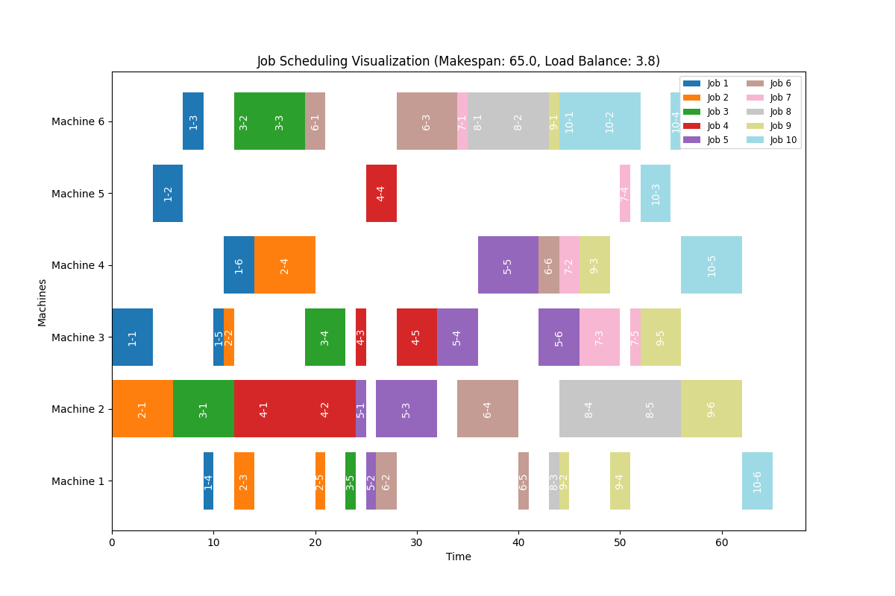
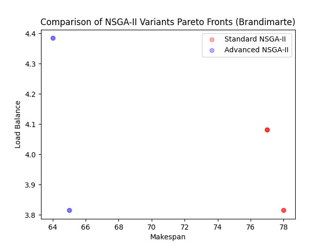
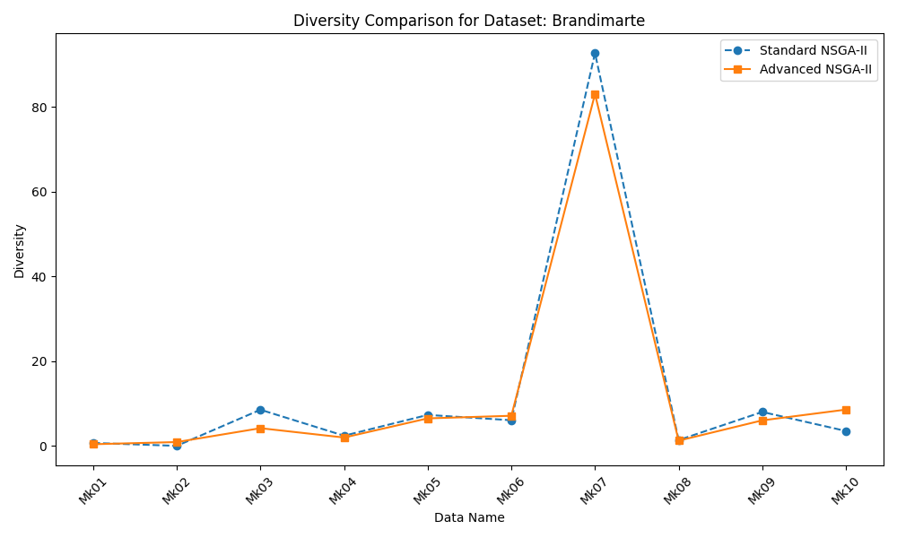
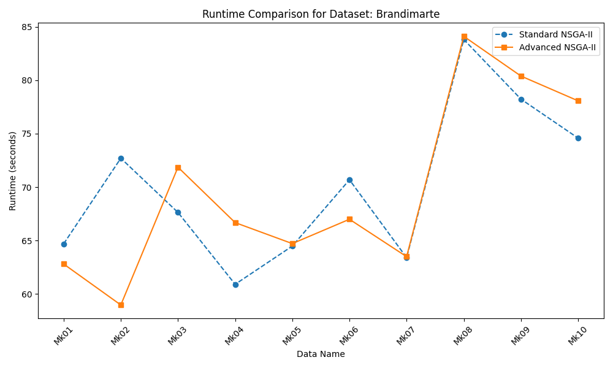

# BioAI_Project

## Heuristic NSGA-II for Flexible Job Shop Scheduling Problems

---

## Table of Contents

1. [Introduction](#introduction)
2. [Overview of Algorithms Ideas](#overview-of-algorithms-ideas)
3. [Experiment Platform](#experiment-platform)
4. [Results](#results)
5. [Visualization](#visualization)
6. [Usage](#usage)
7. [Project Structure](#project-structure)
8. [License](#license)

---

## Introduction
This project focuses on solving the **Flexible Job Shop Scheduling Problem (FJSP)** using a heuristic **NSGA-II** algorithm. FJSP is a well-known NP-hard problem that requires assigning operations to machines in a way that optimizes multiple conflicting objectives, such as **minimizing makespan** and **balancing load** across machines.

The proposed approach integrates heuristic strategies and traditional NSGA-II to improve the initial solution quality and exploration-exploitation balance. By addressing both global diversity and local optimization, this project aims to achieve a comprehensive Pareto front for multi-objective scheduling problems.

[Back to Table of Contents](#table-of-contents)

---

## Overview of Algorithms Ideas
| **Feature**          | **Standard NSGA-II**                                     | **Heuristic NSGA-II**                                            |
|-----------------------|---------------------------------------------------------|---------------------------------------------------------------------------|
| **Initial Population** | Fully randomized solutions.                             | 10% heuristic-based solutions (shortest processing time) and 90% randomized solutions. |
| **Local Search**       | Not applied.                                            | Applied with a 5% probability to refine solutions.                        |
| **Diversity**          | Ensures high diversity due to random initialization.    | Balances diversity with higher-quality initial solutions.                 |
| **Target Objectives**  | Equal emphasis on makespan and load balance.            | Focused on reducing makespan initially, then balancing load through evolution. |
| **Use Case**           | Suitable for general exploration.                       | Best suited for scenarios requirin higher-quality initial solutions. |

[Back to Table of Contents](#table-of-contents)

---

## Experiment Platform
**Work Flow**
1. Data Processing
2. Running Algorithms
3. Output results and visualization


**Supported Features**

| **Feature**             | **Details**                                                                 |
|--------------------------|-----------------------------------------------------------------------------|
| **Supported Algorithms** | - Standard NSGA-II<br>- Heuristic NSGA-II (Advanced NSGA-II)          |
| **Metrics**              | - Hypervolume (HV)<br>- Diversity                                          |
| **Supported Datasets**   | - Barnes<br>- Brandimarte<br>- Dauzere<br>- Other datasets with the same structure                             |
| **Visualization**        | - Gantt Charts (visualizing job scheduling on machines)<br>- Metric Comparison Line Charts (e.g., Diversity, Hypervolume)<br>- Scatter Plot (e.g., Makespan vs. Load Balance) |

- Job scheduling solutions are in `log.txt`.

[Back to Table of Contents](#table-of-contents)

---

## Results

The heuristic NSGA-II demonstrates better diversity compared to the standard version, enabling it to cover the Pareto front more effectively while maintaining a hypervolume performance comparable to the standard version. It particularly exhibits strong exploratory capabilities on more complex datasets. Additionally, despite incorporating heuristic initialization and local search, the improved version does not significantly increase runtime, showcasing good efficiency and stability. And its makespan is smaller. This makes it more suitable for scenarios requiring fast convergence while preserving solution diversity.

| **Parameter**           | **Increasing Advantages**                             | **Increasing Disadvantages**                          | **Decreasing Advantages**                             | **Decreasing Disadvantages**                          |
|--------------------------|------------------------------------------------------|------------------------------------------------------|------------------------------------------------------|------------------------------------------------------|
| **DIVERSIFIED_INIT_PROB** | - Higher initial solution quality<br>- Reduced randomness in early iterations | - Lower solution diversity<br>- May reduce exploration of diverse areas | - Higher solution diversity<br>- Improved exploration capabilities | - Lower initial solution quality |
| **LOCAL_SEARCH_PROB**    | - Improved local solution quality<br>- Pushes solutions towards Pareto front | - Lower solution diversity<br>- Higher computational cost<br>- May lead to overfitting local areas | - Higher diversity<br>- Better exploration of search space | -  Lower chance to refine local optima |

<div align="center">
  
  <p><em>Running Output</em></p>
</div>

[Back to Table of Contents](#table-of-contents)

---

## Visualization
**Brandimarte Dataset** (case)

<div align="center">
  
  <p><em>Standard NSGA-II Job Scheduling (Mk01)</em></p>
</div>

<div align="center">
  
  <p><em>Heuristic NSGA-II Job Scheduling (Mk01)</em></p>
</div>

<div align="center">
  
  <p><em>Comparison NSGA-II Variants (Mk01)</em></p>
</div>

<div align="center">
  
  <p><em>Diversity Comparison</em></p>
</div>

<div align="center">
  
  <p><em>Hypervolume Comparison</em></p>
</div>

<div align="center">
  
  <p><em>Runtime Comparison</em></p>
</div>

[Back to Table of Contents](#table-of-contents)

---

## Usage
**Python**: `3.8.10`

```python
git clone https://github.com/Avalon-S/BioAI_Project.git
```

```python
pip install -r BioAI_Project/requirements.txt # Please check if you need before running
```

```python
python BioAI_Project/main.py # Run everything (data preprocessing, algorithm running, visualization) with one click
```

```python
python BioAI_Project/remove.py # Remove the result and all .ipynb_checkpoints
```

[Back to Table of Contents](#table-of-contents)

---

## Project Structure

```python
BioAI_Project
[data]
   -[Barnes]
   -[Brandimarte]
   -   -[Text]
   -   -   -Mk01.fjs
   -   -   -...
   -   -   -Mk10.fjs
   -[Dauzere]
[result]
   -[Barnes]
   -[Brandimarte]
   -   -[Mk01]
   -   -   -adv_schedule_1.png
   -   -   -comparison_nsga2_variants.png
   -   -   -log.txt
   -   -   -metrics.txt
   -   -   -std_schedule_1.png
   -   -[Mk02]
   -   -...
   -   -[Mk10]
   -[Dauzere]
data_processing.py
batch_processor.py
main.py
metrics.py
nsga2_algorithms.py
visualization.py
remove.py
requirements.txt
```

[Back to Table of Contents](#table-of-contents)

---

## License

This project is licensed under the MIT License. See the `LICENSE` file for details.

[Back to Table of Contents](#table-of-contents)

---

